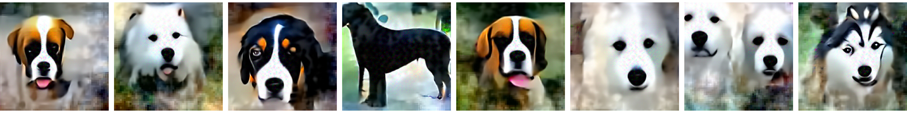

# Asymmetrical Adversarial Training on Restricted ImageNet

## Train and evaluation
1. Create the dog-vs-others dataset: `python create_dataset.py [your ImageNet dir]`.
2. Use train.py to train the robust dog detector. The suggested training procedure is to linearly scale-up the perturbation limit.
3. Use eval.py to evaluate trained model.
4. Use synthesis.py to generate samples, and plot_adv.py to plot adversarial examples.
    ```
    $ python synthesis.py \
    checkpoints-norm_Linf-eps_0.3-step_size_0.001-steps_400/resnet_50_dog_epoch1_iter1000.pth
    ```
    

## Reproduce the robustness test result
1. Download the eps0.02 model.
2. Run robustness test, change step-size and steps accordingly.
    ```
    $ python eval.py --eps 0.02 --norm Linf --steps 40 --step_size 0.001 \
    checkpoints-eps0.02-steps40-stepsize0.001/resnet_50_dog_epoch6.pth
    ```

## Model checkpoints
- eps0.02 model: https://asymmetrical-adversarial-training.s3.amazonaws.com/imagenet-dog-vs-others/checkpoints-eps0.02-steps40-stepsize0.001/resnet_50_dog_epoch6.pth
- eps0.05 model: https://asymmetrical-adversarial-training.s3.amazonaws.com/imagenet-dog-vs-others/checkpoints-norm_Linf-eps_0.05-step_size_0.001-steps_100/resnet_50_dog_epoch5_iter2000.pth
- eps0.1 model: https://asymmetrical-adversarial-training.s3.amazonaws.com/imagenet-dog-vs-others/checkpoints-norm_Linf-eps_0.1-step_size_0.0015-steps_100/resnet_50_dog_epoch3_iter1000.pth
- eps0.3 model: https://asymmetrical-adversarial-training.s3.amazonaws.com/imagenet-dog-vs-others/checkpoints-norm_Linf-eps_0.3-step_size_0.001-steps_400/resnet_50_dog_epoch1_iter1000.pth

